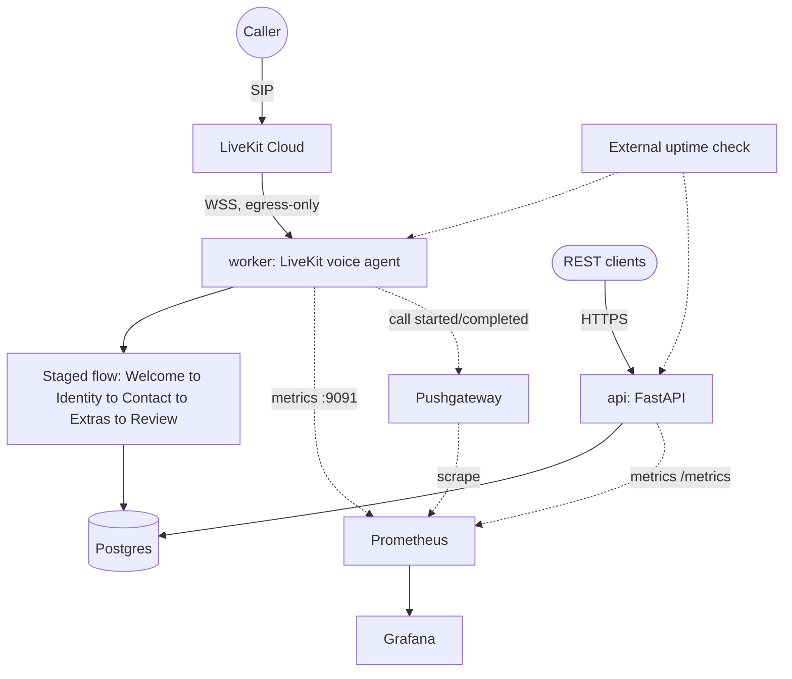

# Patient Intake Voice — Application + Operational Infrastructure

A telephone voice agent for a medical front desk (Part 1), plus the operational infrastructure
to run it in production for a healthcare company (Part 2). This is the single source of truth
for the whole project — what's built, why, what it costs, what's known to be missing, and what
to do next.

**Phone number:** `+1 484 317 4139` — answers as "Sarah," a receptionist for a fictional
practice, and collects name/DOB/contact/insurance through a staged conversation.

## What this is, in one paragraph

A caller dials in; a LiveKit voice agent (`app/worker.py` + `app/flow.py`) walks them through a
staged intake (name → DOB/sex → phone/address → optional insurance/contact/language → read-back
and save), validating each answer and saving the result to Postgres. A separate REST API
(`app/web.py`) exposes the same records over HTTP. Two independent ways to run this in
production exist side by side: **Railway** (actually deployed, live right now) and **GCP /
Cloud Run** (fully written as Terraform, not yet applied — no GCP credentials were available
while building this).

## Architecture



The worker needs **no inbound port to function** — it dials LiveKit Cloud outbound over WSS and
receives call dispatches on that same connection. That's the property that makes the same app
run unmodified on a PaaS with no host-level access (Railway) and on a request-driven,
scale-to-zero-by-default platform (Cloud Run) alike.

---

## Deployment & Hosting

### Railway — the live path

Six services in one Railway project: `worker`, `Api`, `Postgres` (managed), `prometheus`,
`grafana`, `pushgateway`.

- **`worker`** — built from the repo's root `Dockerfile`, default `CMD` (`uv run python -m
  app.worker start`). No public networking for call-handling — it's egress-only. Pinned to
  **exactly one instance, always on** (`min=max=1` on the equivalent GCP resource; Railway's
  version of this is just "don't scale it" since Railway services don't scale-to-zero by
  default the way Cloud Run does) — two workers would both register under the same LiveKit
  agent name (`my-agent`) and race for call dispatch.
- **`Api`** — same Dockerfile, start command overridden to `uv run uvicorn app.web:app --host
  0.0.0.0 --port 8000`. Public domain, target port set to `8000` explicitly.
- **`Postgres`** — Railway's managed Postgres plugin. `app/store.py` normalizes the bare
  `postgres://`/`postgresql://` URL Railway hands out to `postgresql+psycopg://` (the driver
  actually installed — `psycopg2` isn't), so `INTAKE_DB_URL=${{Postgres.DATABASE_URL}}` just
  works with no manual editing.
- **`prometheus` / `grafana` / `pushgateway`** — see Telemetry & Monitoring below.

Deploying: connect the GitHub repo (three times — once per app-code service, since `worker`
and `Api` share a Dockerfile with different start commands; `prometheus`/`grafana` each have
their own small Dockerfile under `infra/observability/`), plus `pushgateway` deployed straight
from the public `prom/pushgateway` Docker image (`source.image`, no build at all — it needs no
config file). Set each service's variables and push to `main`; every push after that redeploys
automatically. First `worker` deploy takes ~60-90s longer than later ones while it downloads
the turn-detector/VAD model cache — expected, not a hang.

### GCP / Cloud Run — written assuming credentials exist, not yet applied

Everything under `infra/terraform/` (10 `.tf` files + `cloudbuild.yaml` + `deploy.sh` +
`terraform.tfvars.example`). Provisions: Artifact Registry, two Cloud Run services (`worker`
pinned always-on with `cpu_idle=false` since it runs a background event loop rather than
serving requests; `api` scales to zero when idle), a Cloud Run Job + Cloud Scheduler for
backups, Secret Manager secrets for every credential, and a Cloud Build trigger that redeploys
on every push to `main`. Uses the **same Railway Postgres** as its database — no second
database stood up.

```bash
cd infra/terraform
cp terraform.tfvars.example terraform.tfvars   # fill in; never commit the filled-in file
./deploy.sh                                     # terraform apply, then the first build+deploy
```

One manual prerequisite Terraform can't automate: the Cloud Build GitHub App must be connected
to this repo once via GCP Console (**Cloud Build → Triggers → Connect Repository**) before
`google_cloudbuild_trigger` can be created.

**Why the worker needed one code change for Cloud Run specifically:** Cloud Run health-checks
a container on whatever port it injects via `$PORT`. One line in `app/worker.py` makes the
health server respect it:
```python
server = AgentServer(port=int(os.environ.get("PORT", "8081")), ...)
```
Defaults to `8081` everywhere `$PORT` isn't set (Railway, local `uv run`), so this is
backward-compatible, not Cloud-Run-specific.

**Neither path has been run end-to-end by me on GCP** — Terraform was never `apply`'d (no
`terraform`/`gcloud` binaries in the environment this was built in). Run `terraform fmt -check`
and `terraform validate` before `apply`. Railway *is* live and verified (see Incident Response).

### Local development (no Docker)

```bash
uv sync
uv run python -m livekit.agents download-files   # first run only
uv run python -m app.worker console               # talk to it via mic/speaker, no phone needed
uv run uvicorn app.web:app --reload                # REST API at http://localhost:8000/docs
```
Falls back to a local SQLite file if `INTAKE_DB_URL` isn't set — unrelated to whichever
deployment is actually answering the real phone number.

---

## Database & Persistence

One table, `patient_records`, via SQLAlchemy (`app/store.py`):

| Column | Type | Notes |
|---|---|---|
| `record_id` | `VARCHAR(32)` PK | App-generated `uuid4().hex`, no DB-side default |
| `given_name`, `family_name` | `VARCHAR(60)` NOT NULL | |
| `birth_date` | `DATE` NOT NULL | |
| `sex` | `VARCHAR(20)` NOT NULL | |
| `phone` | `VARCHAR(10)` NOT NULL, indexed | National (10-digit) form |
| `street`, `city` | NOT NULL | `unit` optional |
| `state` | `VARCHAR(2)` NOT NULL | |
| `postal_code` | `VARCHAR(10)` NOT NULL | |
| `email`, `insurer`, `member_id`, `contact_name`, `contact_phone` | nullable | |
| `language` | `VARCHAR(60)` NOT NULL, default `English` | |
| `created_at`, `updated_at` | `TIMESTAMPTZ` NOT NULL | Server defaults + onupdate |
| `archived_at` | `TIMESTAMPTZ` nullable | Soft-delete marker |

`app/schema.sql` is a hand-verified mirror of this (cross-checked column-for-column against
SQLAlchemy's own compiled DDL for the postgres dialect) — not required, since `create_schema()`
runs automatically on startup, but useful for inspecting the schema without running the app.

**One shared database, two deployment paths.** Railway's managed Postgres is the database for
*both* the Railway deployment and the (unapplied) GCP one — deliberately, to avoid running two
databases in sync for one app. First thing to change if GCP becomes primary: move to a
GCP-native database (Cloud SQL) with proper backups there instead of relying on Railway's.

**No migration tooling.** `create_schema()` is `CREATE TABLE IF NOT EXISTS` only — it will never
`ALTER` an existing table. Fine for one table that hasn't changed shape since Part 1; adding
Alembic now would be tooling for a problem that doesn't exist yet. Required *before* the next
schema change, not before this one.

**Returning-caller handling:** a call matched by phone number is offered an update path;
`save_record` marks the state as "updating" once a row exists, and a later in-call correction
in the same call updates rather than duplicates the row (a real bug found and fixed earlier in
this build — the first `save_record` call didn't mark this, so a mid-call correction created a
second, duplicate row instead of updating the first).

---

## Backup Strategy

`scripts/backup.sh` / `restore.sh` / `s3_object.py` — dump, gzip, upload; restore from the
latest (or a specific) object. Talks to storage purely through the S3 API via `boto3`, which
means the *same* script works against real S3, MinIO, or GCS (which exposes an S3-compatible
endpoint) without any storage-specific code — just a different `AWS_ENDPOINT_URL` and
credentials.

- **GCP path**: fully wired. `infra/terraform/backup.tf` — a Cloud Run Job (not a long-running
  loop; bills only for the seconds a run takes) triggered every 15 minutes by Cloud Scheduler,
  writing to a versioned, lifecycle-managed GCS bucket via an auto-generated HMAC key
  (`google_storage_hmac_key`) standing in for AWS credentials. Restore:
  ```bash
  gcloud run jobs execute patient-intake-backup --region=<region> --command=./restore.sh
  ```
- **Railway path**: **not wired yet.** Railway has no built-in object storage, so this needs
  either a real (free-tier) S3-compatible bucket (Cloudflare R2, Backblaze B2) or a small
  scheduled Railway service. This is the single biggest gap in the live deployment — see Known
  Risks.

---

## Telemetry & Monitoring

**Prometheus + Grafana + Pushgateway are deployed and live on Railway** (three more services;
Prometheus and Grafana each bake the repo's config into the stock image via their own small
Dockerfile under `infra/observability/`, since Railway builds from a Dockerfile, not volume
mounts — Pushgateway needs no config at all, deployed straight from the public
`prom/pushgateway` image). Scraping over Railway's private networking
(`worker.railway.internal:9091`, `api.railway.internal:8000/metrics`,
`pushgateway.railway.internal:9091`).

The Grafana dashboard (`infra/observability/grafana/dashboards/overview.json`) has 8 panels,
all confirmed showing real data: Worker up/down, API up/down, API requests/sec by status, API
p95 latency, API 5xx error rate, **and three call-level panels** — Patients Registered (Total),
Time Since Last Call Started, Last Call Outcome.

**A real, verified SDK limitation — not a config mistake.** The worker's own metrics
(`lk_agents_worker_load`, `lk_agents_active_job_count`,
`lk_agents_proc_initialize_duration_seconds`) are correctly defined in the installed
`livekit-agents` SDK with proper multiprocess-mode Prometheus wiring
(`livekit/agents/telemetry/metrics.py`) — traced into the SDK source to confirm this. But
verified, by directly querying the live Prometheus instance, that they never populate. This
isn't "no data yet": even `proc_initialize_duration_seconds`, tied to an event known to have
fired repeatedly (the worker's own logs show `"process initialized"` multiple times), shows
zero samples. The `/metrics` endpoint itself is healthy (`200 OK`, correct `Content-Type`, just
`Content-Length: 0`) — points at the cross-process metrics-file aggregation
(`PROMETHEUS_MULTIPROC_DIR`) not working correctly in this specific environment, for a reason
that needs shelling into the container to diagnose further (not available through the Railway
CLI). Only `up{job="worker"}` (scrape-based liveness) was real for the worker from the SDK's
own instrumentation.

**Real call-level metrics were added on top of that, to fix exactly this gap** (`app/metrics.py`
+ `PatientStore.count()`/`app/web.py`) — see the next section.

**GCP path:** no Prometheus/Grafana/Pushgateway deployed there — out of scope for that pass.
Cloud Run's own native per-service request/latency/error metrics and log explorer are the
closest equivalent with zero extra setup.

### Call-level metrics — the fix for "no visibility into what this system actually does"

Generic REST metrics (API request rate, latency) don't answer the one question that actually
matters for a voice agent: *is it answering calls, and are they completing successfully?* Two
different, deliberately different mechanisms close that gap, chosen to avoid two separate
known problems:

- **`patient_records_total`** (`app/web.py`) — a genuinely cumulative count, computed via
  `Gauge.set_function()` re-running a real SQL `COUNT` (`PatientStore.count()`) on every
  `/metrics` scrape. Needs no Pushgateway, no cross-process aggregation, nothing extra — it
  runs in the same process already confirmed to produce real metric content. The one caveat:
  a returning caller's call updates their existing row rather than inserting a new one, so this
  undercounts total call *volume* if there are many repeat callers — it's "patients on file,"
  not "calls answered."
- **`call_last_started_timestamp_seconds` / `call_last_completed_timestamp_seconds` /
  `call_last_outcome`** (`app/metrics.py`, called from `app/worker.py`'s `handle_call` and
  `app/flow.py`'s `save_record`) — pushed to the new `pushgateway` service. Call-handling code
  runs in a fresh per-call job subprocess (LiveKit's process pool), so there's no single
  long-lived process to scrape an in-memory counter from — the same underlying problem the
  SDK's own (broken) mechanism was meant to solve. The naive fix — push one metric group per
  call, keyed by room name — is a **documented Prometheus anti-pattern**: Pushgateway keeps
  every pushed group forever unless explicitly deleted, so a unique key per call means its own
  `/metrics` grows without bound
  (https://prometheus.io/docs/practices/pushing/#should-i-be-using-the-pushgateway). Avoided by
  pushing under **one fixed job name** (`patient_intake_worker`, no per-call label) via
  `pushadd_to_gateway` (HTTP POST — merges metric *names* into what's already there, unlike
  `push_to_gateway`'s PUT, which would wipe every other gauge under that job on each push) — the
  same safe, bounded pattern `scripts/backup.sh`'s own heartbeat already used. The trade-off:
  these are "last call" snapshots, not a true running counter — good for "is anything happening,
  and how did it go," not for "how many calls total" (that's what `patient_records_total` is
  for). Every push is best-effort (a Pushgateway hiccup, or `PUSHGATEWAY_URL` simply being unset
  in local dev, never affects call handling — see `app/metrics.py`'s own module docstring).

**Verified end-to-end, not just deployed:** after wiring this up, confirmed the full path for
real — pushed a live test event with the actual app code
(`python -c "from app import metrics; metrics.call_started(); metrics.call_completed(success=True)"`)
against the deployed Pushgateway, then confirmed Prometheus picked it up with the correct
`job="patient_intake_worker"` label (not `job="pushgateway"` — `honor_labels: true` in
`prometheus.yml` is what makes that work) via a direct API query. The next *real* call will
overwrite that test data with the genuine thing.

---

## Logging & Observability

Structured JSON everywhere: the worker via the LiveKit CLI's own JSON formatter, tagged with
the call's `room` name (`app/worker.py`) so every log line from one call can be filtered
together; the API via `app/obs.py`, tagged with a `request_id`. Railway's and (would-be) Cloud
Run's log viewers are both natively searchable — no separate log-aggregation stack (Loki, etc.)
is deployed for either path.

**To trace one call end-to-end:** find its LiveKit room name (visible in the worker's
`"received job request"` log line, or as the room part of the SIP participant identity), then
filter the worker's log stream by that string — every stage transition, tool call, and error
for that specific call shares it.

**PHI-in-logs caution:** the LiveKit framework logs tool call arguments/results (names, DOB,
addresses) at `DEBUG` level. Every environment in this repo runs at `INFO`. Do not lower this
in production without separately handling log-level PHI exposure.

---

## Alerting

`infra/observability/alert_rules.yml` defines 10 rules, loaded into the deployed Prometheus and
evaluating live on its own `/alerts` page (confirmed all 10 report `health: ok` — no PromQL
errors). Split by whether they can actually fire:

- **Real, can fire, have live data:** `WorkerDown`, `APIDown`, `HighAPIErrorRate`, and two new
  ones added alongside the call-level metrics above — **`NoRecentCallActivity`** (no call
  dispatched in over an hour) and **`RecentCallFailedToSave`** (the most recent call's intake
  failed to persist). These are the ones actually worth watching.
- **Real rule, no data source, can never fire regardless of Alertmanager:** `WorkerLoadHigh`
  (depends on the SDK's broken `lk_agents_worker_load`), `PostgresDown`/`HostMemoryLow`/
  `DiskSpaceLow` (need postgres-exporter/node-exporter, never deployed on Railway's PaaS model
  — no host-level access for those), `BackupStale` (needs a Railway-side backup loop pushing
  the heartbeat, not wired yet — see Backup Strategy). Kept as reference/honest documentation
  of what a fuller deployment would also want, not deleted to make the list look shorter.

**But nothing delivers any of them anywhere** — no Alertmanager is deployed (deliberately
scoped out; see Cost Awareness).

**What actually notifies anyone right now:** an external uptime checker (e.g. UptimeRobot free
tier, 5-minute interval) against three URLs — the worker's health port (predicts whether the
phone number will actually be answered), the API's `/health`, and its `/readyz` (which
round-trips Postgres, catching a DB problem `/health` deliberately ignores). Real, external,
zero-infrastructure, and survives even if Railway's dashboards or the Prometheus stack go down.

Next step: deploy Alertmanager as a third observability service (or point `/metrics` at Grafana
Cloud's free tier) so the rules that already evaluate actually page someone.

---

## Secrets Management

- **Railway**: every credential (`LIVEKIT_URL`/`API_KEY`/`API_SECRET`, `INTAKE_DB_URL`, Grafana
  admin user/password) is a Railway service Variable, set via the dashboard or
  `railway variable set`. `INTAKE_DB_URL` is a live reference (`${{Postgres.DATABASE_URL}}`),
  not a copy-pasted value. Nothing is committed to the repo.
- **GCP**: every credential is a Secret Manager secret (`infra/terraform/secrets.tf`), created
  from Terraform variables and referenced by Cloud Run services via real secret references
  (`value_source.secret_key_ref`), never as plain env vars. The backup path's S3-compatible
  credentials are an auto-generated `google_storage_hmac_key` — Terraform creates them, no
  human ever types or sees a long-lived key.
- **Local dev**: `.env.local`, gitignored, loaded only by `app/worker.py`. `.env.example`
  documents the shape with no real values.
- **Verified**: `.dockerignore` excludes `.env*` and `*.db` from every image build (all three
  Dockerfiles in this repo share one `.dockerignore`); `.gitignore` excludes `terraform.tfvars`
  and `.env.local`. No secret value has been committed at any point.

---

## Security Posture

Honest inventory, not a compliance certification — awareness the challenge brief explicitly
asks for, not full HIPAA implementation.

**What counts as PHI here** — every row in `patient_records` is PHI in aggregate, mapped to
HIPAA Safe Harbor identifiers (§164.514(b)(2)): names (`given_name`/`family_name`/
`contact_name`), geographic subdivisions smaller than a state (`street`/`unit`/`city`/
`postal_code`), dates (`birth_date` explicitly, record timestamps in context), phone numbers,
email, health plan beneficiary number (`member_id`), and the record ID itself as a unique
identifying code.

PHI also exists **outside the database**, in-flight, during every call: audio and transcripts
pass through LiveKit Cloud and, via LiveKit Inference, to Deepgram (STT), OpenAI (LLM), Cartesia
(TTS), and ai-coustics (noise cancellation) — **all would need a BAA before real patient
traffic**, none of which is negotiated here. The full spoken intake lives in the LLM's chat
context for the call's duration.

**Implemented:**
- Secrets never committed or baked into images (see Secrets Management above).
- GCP path: Secret Manager `SecureString`-equivalent secrets, IAM-scoped service account, no
  static long-lived cloud credentials on any compute resource (the backup job authenticates via
  an HMAC key tied to a service account, not a root credential).
- Structured, correlatable logs (`room`/`request_id`) mean an operator can trace a call or
  request without a separate PHI-bearing audit column.
- Worker has no listening surface relevant to calls — egress-only to LiveKit Cloud/Inference,
  no inbound port a caller's SIP session reaches directly.

**Explicitly deferred (real gaps, not hidden):**

| Gap | HIPAA reference | What real readiness needs |
|---|---|---|
| **No authentication on `/patients*` at all** | §164.312(d) | An API-key requirement was built mid-session and deliberately rolled back to match the app's original, pre-assessment behavior. Anyone who can reach the API can read/write/archive every patient record. **The single biggest gap in either deployment.** Real fix: per-staff-member credentials (OAuth/OIDC), not even just a shared key. |
| No audit log of who read/changed a record | §164.312(b) | A dedicated, append-only audit table (who/what/when) — application logs aren't tamper-evident or access-controlled the same way. |
| No formal data retention/deletion policy | §164.310(d)(2)(i) | `DELETE` is a soft delete (`archived_at`) — the row and its PHI are retained forever. Needs an actual purge process and a defined retention period. |
| No BAAs in place | 45 CFR §164.502(e) | LiveKit/Deepgram/OpenAI/Cartesia/ai-coustics all need executed BAAs before real PHI flows through them. |
| No encryption-in-transit enforcement between services | §164.312(e) | Acceptable today only because Railway's private network isn't reachable from outside; a multi-host deployment would need TLS between services. |
| Alerting has no external delivery | — | See Alerting above. |

**Attack surface:** publicly reachable — the `api` service only (and per the gap above, with no
authentication in front of it). Not public — Grafana, Prometheus, Postgres, the worker's health/
metrics port (all Railway-internal-network-only or credential-gated). The worker has no
call-relevant listening surface at all.

---

## CI/CD

`.github/workflows/ci.yml` — on every push to `main` and every PR: `ruff check`, `pytest`
(pinned to Python 3.13 to match the Dockerfile's runtime — a real test-collection issue during
this build was traced to the local dev venv drifting to 3.14), then a Docker build of the root
image (no push — no registry configured for this exercise, build-only validates the Dockerfile
still works).

**Railway**: pushing to the connected branch redeploys automatically. A direct
`railway up --service <name>` (uploads the current directory straight to Railway) is also
available as an immediate deploy path, and turned out to be the fix for a real incident — see
Incident Response.

**GCP**: `infra/terraform/cloudbuild.yaml`, triggered by `google_cloudbuild_trigger` on push to
`main` — builds the app image and the backup image, pushes both to Artifact Registry, then
`gcloud run deploy`/`jobs update` each with just `--image` (everything else — secrets, scaling,
service account — was set once by Terraform and Cloud Run preserves it across an image-only
update; `cloud_run.tf`'s `lifecycle.ignore_changes` is what stops a later `terraform apply`
from reverting Cloud Build's deploy back to the bootstrap placeholder image).

---

## Cost Awareness

**Railway** (Hobby plan, upgraded from Trial mid-build — see Incident Response): `worker`
always-on (~2-2.5GB RAM, the size of its inference subprocess), `Api` scales to zero when idle,
`Postgres` managed, `prometheus`/`grafana`/`pushgateway` are small, low-traffic services (the
last one holds a handful of gauges under one fixed job name — deliberately bounded, see
Telemetry & Monitoring, so it stays small rather than accumulating one group per call forever).
Modest — nowhere near the "$5,000/month" end of the brief's own cost-awareness question,
appropriate for hundreds-of-calls-a-week volume.

**GCP** (unapplied, so no real bill yet): `worker` pinned always-on is the only always-billed
compute; `api` scales to zero; Secret Manager, Artifact Registry, and Cloud Scheduler are all
effectively free at this scale; Cloud Build has a free tier of build-minutes that this project's
occasional pushes wouldn't exceed.

**Deliberately not built**, because the workload doesn't justify it: Kubernetes (hundreds of
calls/week on one worker doesn't need it — the brief explicitly warns against over-engineering
here), multi-region/HA (a single always-on worker instance is a conscious single point of
failure at this call volume, and on Cloud Run a deliberate *cap*, since two workers would race
for the same LiveKit dispatches), a second GCP-native database (reusing the existing Railway
Postgres avoids running two databases in sync for one app), full OpenTelemetry trace export
(investigated first — the pinned SDK version has no active producer for its
`metrics.LLMMetrics`/`TTSMetrics` classes; not fabricated as already done).

---

## Incident Response

**How to diagnose a failed or silent call:** find the room name in the worker's logs, filter by
it, and look for where the sequence of `"received job request"` → tool calls → TTS/LLM activity
stops. A caller hanging up with `reason: CLIENT_INITIATED` within a couple seconds usually means
the caller hung up before the greeting arrived (check cold-start timing); a long gap with no
further activity and no error usually means a stuck network call to LiveKit's inference gateway.

**Three real incidents hit and fixed while building/operating this:**

1. **Railway deployment stuck in `"Queued"` for 10+ minutes**, reason reported as *"upstream
   GitHub issues"* — confirmed no actual outage on GitHub's or Railway's own status pages, and
   it survived a full delete-and-recreate of the service. **Fix:** deploy directly via
   `railway up --service <name>` (uploads the current directory straight to Railway, bypassing
   the GitHub webhook path entirely) instead of continuing to wait on or retry the stuck
   webhook-triggered build.
2. **Worker crash-looping with `DuplexClosed` / `"failed to get memory info for process"`**,
   immediately after `"starting inference executor"` in the logs. Root cause: the inference
   subprocess needs ~2-2.5GB RAM; Railway's Trial plan caps a service around 1GB, OOM-killing it
   every single startup. Not a code bug — a plan limit. **Fix:** upgrade off the Trial plan
   (Hobby's default 8GB limit has comfortable headroom).
3. **API returning `502 Application failed to respond`** on every request, despite the
   container logging `"Uvicorn running on http://0.0.0.0:8000"` and being perfectly healthy.
   Root cause: the service's public domain had `targetPort: null` — never explicitly set — so
   Railway's edge didn't know which port to route to. **Fix:**
   `railway domain update <domain> --port 8000 --service Api`. If `/health` 502s on a freshly
   created domain with an otherwise-healthy container, check the target port first.

A fourth, build-time-only incident: both the Prometheus and Grafana Docker builds failed with
`"/infra/observability/prometheus.yml": not found"`, even though the file is in the repo.
`.dockerignore` blanket-excluded `infra/` — fine when only the root app Dockerfile existed, but
`.dockerignore` applies to *every* image built from this repo context, so it silently stripped
the exact files the new Dockerfiles needed to `COPY`. Fixed by removing that exclusion (no
secrets live under `infra/` — `terraform.tfvars` is separately gitignored).

**Rollback:** Railway keeps prior deployments per service — "Redeploy" an older one from the
Deployments tab. GCP's Cloud Build pipeline tags images by commit SHA, so `gcloud run deploy
<service> --image=...:<old-sha>` is a real rollback path there (not yet exercised).

---

## Documentation

This file. Deliberately consolidated into one document (an earlier draft split this across
`RAILWAY.md`, `infra/GCP_DEPLOYMENT.md`, `docs/RUNBOOK.md`, `docs/SECURITY.md` — all removed in
favor of this single source of truth). The repo itself is the rest of the documentation: read
`infra/terraform/*.tf` for the exact GCP resources, `infra/observability/` for the
monitoring/alerting config, `scripts/` for the backup/restore implementation.

---

## Trade-offs and known risks (explicit)

- **Neither deployment path has a fully independent test of "does it survive a restart without
  data loss"** run by me end-to-end on GCP specifically (Railway has been — the database
  persists across the redeploys and incidents documented above).
- **No authentication on the patient-record API at all**, on either path — see Security
  Posture. The single biggest concrete risk if this ever touched real PHI.
- **No automated backups on the live (Railway) deployment** — the backup code is real, tested
  in concept, and fully wired on the GCP path, but Railway has no object storage of its own and
  nothing has been pointed at an external one yet.
- **No alert delivery anywhere** — rules evaluate, nothing pages anyone except the external
  uptime check's narrower up/down signal.
- **The worker's own Prometheus metrics (load, active calls) don't work**, for a reason not
  fully root-caused (see Telemetry & Monitoring) — a genuine, verified SDK-level limitation in
  this environment, not something to paper over. Worked *around* (not fixed) with real
  call-level metrics pushed to Pushgateway plus a Postgres-derived cumulative count — but those
  are "last call" snapshots and a proxy count, not a true per-call counter (see Telemetry &
  Monitoring's "Call-level metrics" section for exactly what that trade-off costs).
- **PHI leaves the deployment boundary** to five subprocessors with no BAAs in place.
- **Single always-on worker instance is a conscious SPOF** at this call volume — deliberate,
  not accidental, and documented as such under Cost Awareness.
- **GCP Terraform was never `apply`'d or `validate`'d** — written and cross-checked by hand
  (every resource/variable/secret-key reference across all 10 `.tf` files), but not proven
  against a real project.

## Next steps, in the order I'd actually do them

1. Wire real backups for the Railway deployment — either a free-tier S3-compatible bucket
   (Cloudflare R2/Backblaze B2) or a small scheduled Railway service running the same
   `scripts/backup.sh` unchanged.
2. Deploy Alertmanager as a third Railway observability service (or point `/metrics` at Grafana
   Cloud's free tier) so the alert rules that already evaluate actually notify someone.
3. Add real API authentication — per-caller OAuth/OIDC, not a single shared key — plus the
   audit-log table described under Security Posture.
4. Run the GCP path for real once credentials exist: `terraform validate`, `apply`, a live
   phone call against it, and a real backup/restore drill against its GCS bucket.
5. Replace the "last call" Pushgateway snapshot with a proper `call_sessions` table (started
   at, completed at, outcome) so call volume/completion-rate can be graphed as a true time
   series, not just "time since the last one" — the honest next step now that the simpler
   version has proven the pattern works end-to-end.
6. Root-cause the worker's Prometheus multiprocess metrics gap properly — needs shell access
   inside the running container to inspect `PROMETHEUS_MULTIPROC_DIR` directly, which the
   Railway CLI doesn't expose. Lower priority now that call-level visibility exists via a
   different path.
7. Wire an OTel trace exporter (Tempo/Grafana Cloud Tempo) for real per-call LLM/STT/TTS
   latency graphs, once the SDK version in use actually produces those spans.

---

## Application details (Part 1)

### How it's put together

The call isn't driven by one big prompt — it's a pipeline of small **stages**, each responsible
for a slice of the form, handing control to the next when its part is done:

```
Welcome  →  Identity  →  Contact  →  Extras (optional)  →  Review & save
```

Collected values accumulate in a single `IntakeState` object attached to the session, so a
stage only ever sees the tools/instructions relevant to its step — smaller LLM turns, better
latency, easier to extend.

### Modules

| File | Responsibility |
|------|----------------|
| `app/worker.py` | LiveKit entrypoint — assembles the STT/LLM/TTS pipeline, starts the flow, exposes health + Prometheus metrics. |
| `app/flow.py` | `IntakeState` + the five stage agents and their handoff/validation tools; logs save outcomes for call↔record tracing. |
| `app/schema.py` | Reusable `Annotated` validated field types and the `NewPatient`/`PatientChanges` models. |
| `app/schema.sql` | Hand-verified mirror of the Postgres DDL, for inspection only. |
| `app/store.py` | `PatientStore` (SQLAlchemy) — reads, writes, archive (soft delete), `/readyz` ping. |
| `app/web.py` | FastAPI service: patient CRUD, `/health`, `/readyz`, `/metrics`. |
| `app/obs.py` | JSON log formatter + request-id middleware for the API. |
| `app/metrics.py` | Call-level "last call" gauges pushed to Pushgateway under one fixed job name — see Telemetry & Monitoring for why. |
| `app/us_states.py` | Accepted USPS state/territory codes. |

### API endpoints

No authentication on any route (see Security Posture).

- `GET /health` — liveness (static, no DB touch)
- `GET /readyz` — readiness (real DB round-trip)
- `GET /metrics` — Prometheus format
- `GET /patients?family_name=&birth_date=&phone=`
- `GET /patients/{record_id}`
- `POST /patients` → `201`
- `PATCH /patients/{record_id}` — partial update; only supplied fields change
- `DELETE /patients/{record_id}` — archive (soft delete)

### Fields

Required: `given_name`, `family_name`, `birth_date`, `sex` (`Male`/`Female`/`Other`/`Decline to
answer`), `phone`, `street`, `city`, `state`, `postal_code`. Optional: `unit`, `email`,
`insurer`, `member_id`, `language`, `contact_name`, `contact_phone`.

### Tech

LiveKit Agents (real-time voice pipeline) + LiveKit Inference (STT `deepgram/nova-3`, LLM
`openai/gpt-4.1`, TTS `cartesia/sonic-3` — one set of LiveKit credentials, no separate provider
keys) + Silero VAD + multilingual turn detector + ai-coustics noise cancellation + FastAPI +
SQLAlchemy + Postgres + Pydantic + phonenumbers. `uv` for environment/dependency management;
Docker for the deployable image; Terraform for the GCP path.

### Tests

```bash
uv run python -m pytest
```
23 tests: validation layer (phone/date/state/zip/sex/email normalization, required-field
enforcement), the full API flow (create/read/filter/partial-update/archive, `/health`,
`/readyz`), and the flow/state contract (`IntakeState.collected()`, the paced per-line spoken
readback).
