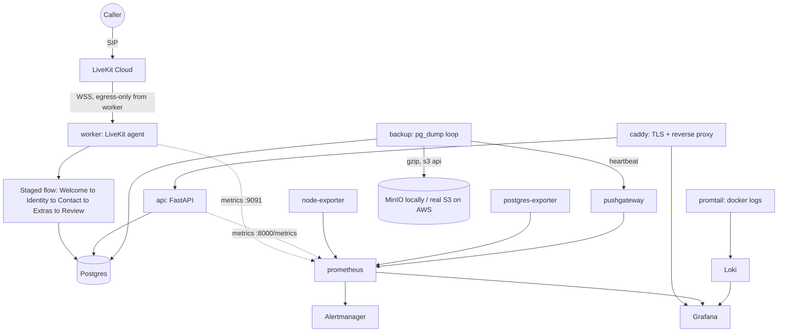

# Patient Intake Voice — Application + Operational Infrastructure

A telephone voice agent for a medical front desk (Part 1), plus the operational infrastructure
to run it in production for a healthcare company (Part 2): deployment, a Postgres-backed data
layer, backups with a tested restore path, telemetry, alerting, API auth, CI, and
infrastructure-as-code.

**Phone number:** `+1 484 317 4139` — answers as "Sarah," a receptionist for a fictional
practice, and collects name/DOB/contact/insurance through a staged conversation.

## Verification status — read this first

Every config in this repo was written and statically checked (YAML/JSON parsed, HCL
cross-referenced by hand, Python/tests actually executed), but **this stack was built in a
sandbox with no Docker, no Terraform, and no browser for Railway's OAuth login** — I could not
run `docker compose up`, build the image, `terraform validate`, or `railway login` myself.
Concretely:

- ✅ **Actually run and passing**: `uv run ruff check .`, `uv run python -m pytest` (23 tests),
  a live smoke test of `/health`, `/readyz`, `/metrics` via `TestClient` (no Docker needed for
  this — pure Python).
- ✅ **Actually verified against real behavior**: the Dockerfile's HF-cache fix, `download-files`
  auto-discovery, and the exact Prometheus metric names/labels the API exposes were each
  confirmed against the real `livekit-agents`/`prometheus-fastapi-instrumentator` source and a
  live smoke run — not assumed.
- ⚠️ **Written but not executed by me**: the actual Railway deployment (`RAILWAY.md`),
  `docker compose build/up`, the backup→restore drill, the Terraform plan, and a real phone
  call against either deployed stack. See the **Verification checklist** below for the exact
  commands to run.

I'm flagging this prominently rather than presenting untested infrastructure as proven.

## Deployment paths

Three, for three different constraints:

1. **Railway (`RAILWAY.md`) — the actual live deployment for this submission.** Cloud
   credentials for a self-managed AWS deploy weren't available, and a managed platform is
   explicitly sanctioned by the challenge FAQ ("justify it and build operational tooling on top"
   — not just clicking Deploy). Covers worker + api + Postgres, which is what needs to actually
   answer the phone number.
2. **Docker Compose (below) — full local stack for review.** Everything Railway's PaaS model
   can't host cleanly (self-hosted Prometheus/Grafana/Loki/Alertmanager, since Railway has no
   host-level access for node-exporter/Promtail and already gives you metrics/logs natively)
   still runs here, so the complete operational design is demonstrable even though it's not
   what's live on Railway.
3. **Terraform (`infra/terraform/`) — ready for AWS the moment real cloud credentials exist.**
   Provisions a real S3 bucket + IAM role + SSM-stored secrets + EC2 host running this same
   Compose stack; needs zero code changes, just `terraform apply` once credentials arrive.

## Architecture



The worker needs **no inbound port to function** — it dials LiveKit Cloud outbound over WSS and
receives call dispatches on that same connection. Every port it exposes (`:8081` health,
`:9091` metrics) is for the operator, not the phone path — which is why this whole stack can run
on a laptop and the phone number stays answerable the whole time it's up.

## Quickstart — Docker Compose (full-stack local review)

```bash
cp .env.example .env   # fill in LIVEKIT_* and pick passwords for everything else
docker compose --profile local-s3 up -d --build
```

`--profile local-s3` brings up MinIO as a stand-in S3 bucket; drop it for the real-AWS
deployment described below. First boot takes longer than usual (~60–90s) while the worker
downloads the ~1GB turn-detector/VAD model cache — expected, not a hang. Then:

```bash
docker compose ps                       # everything healthy?
curl localhost:8000/health              # {"status": "up"}
curl localhost:8000/readyz              # {"status": "ready"} — actually round-trips Postgres
curl localhost:8000/patients
```

> **Don't run this worker at the same time as the Railway deployment.** Both register under
> the same LiveKit agent name (`my-agent`), and LiveKit dispatches a given call to *whichever*
> registered worker it picks — with two different Postgres databases behind them, that's a
> confusing way to lose track of which one saved a given call's record. Stop one before
> starting the other.

Call `+1 484 317 4139` — same phone number as Part 1 — while whichever worker you intend to
test (this one, or Railway's) is the only one registered.

Dashboards/UIs (bind to `127.0.0.1` only — not internet-exposed, see `docs/SECURITY.md`):

| What | Where |
|---|---|
| Grafana (Overview dashboard) | `http://localhost:3000` (login: `admin` / `GRAFANA_ADMIN_PASSWORD`) |
| Prometheus | `http://localhost:9090` |
| Alertmanager | `http://localhost:9093` |
| MinIO console | `http://localhost:9000` |

Only the patient-record API itself goes through Caddy/TLS (`https://<PUBLIC_DOMAIN>/`) — it's
the one service with a real reason to be internet-facing; everything else stays operator-only,
direct-port, on this host (see `infra/caddy/Caddyfile`).

## Railway deployment (the live path for this submission)

Full steps in **`RAILWAY.md`** — worker + api + a managed Postgres, no cloud credentials
needed. The one code change it required, `app/store.py` normalizing Railway's bare
`postgresql://` `DATABASE_URL` to the `+psycopg` driver actually installed, is already in.
Alerting/backups aren't re-hosted on Railway itself in this pass (see `RAILWAY.md`'s "Known
gaps" section for the honest reasoning and the cheapest next step for each).

## Cloud deployment (AWS, once credentials exist)

```bash
cd infra/terraform
cp terraform.tfvars.example terraform.tfvars   # fill in; never commit the filled-in file
terraform init
terraform fmt -check && terraform validate     # NOT run in this session — do this first
terraform plan
terraform apply
```

Provisions: a security group (80/443 open, SSH closed by default), an EC2 instance (Ubuntu
22.04, `t3.large` default) with an IAM role scoped to SSM (secrets) and the backup S3 bucket
only, an Elastic IP, an S3 bucket (versioned, SSE-KMS, 90-day lifecycle), and SSM `SecureString`
parameters for every secret. Cloud-init pulls the repo, reads secrets back out of SSM, writes
`.env`, and runs `docker compose up -d --build` (no `local-s3` profile — the instance's IAM role
covers S3 access, so no MinIO on that box at all). Route53 record creation is optional
(`manage_dns`) since the hosted zone may not be in the same account as these credentials.

## Operating the system

- **Runbook** (`docs/RUNBOOK.md`): agent not answering, high latency, database down, restore
  from backup, rollback a bad deploy, tracing one call end-to-end.
- **Security posture** (`docs/SECURITY.md`): PHI field inventory, subprocessor BAA list, what's
  implemented vs. deliberately deferred, mapped to HIPAA references.
- **Alerting** (`infra/observability/alert_rules.yml`): `WorkerDown`, `APIDown`, `PostgresDown`,
  `BackupStale` (dead-man's-switch on the backup heartbeat), `HighAPIErrorRate`,
  `WorkerLoadHigh`, `HostMemoryLow`, `DiskSpaceLow`. Fire into Alertmanager's UI only by choice
  for this exercise — wiring a Slack/email receiver is a config change in
  `infra/observability/alertmanager.yml`, not new code.
- **Logs**: structured JSON everywhere (worker via the LiveKit CLI's own JSON formatter, API via
  `app/obs.py`), shipped to Loki by Promtail's Docker service discovery — no per-service scrape
  config to maintain as services are added.

## Verification checklist

0. **Railway (do this one — it's the live submission path)**: follow `RAILWAY.md`, then call
   `+1 484 317 4139` and confirm `GET /patients` shows the new row in Railway's Postgres. Check
   both services' Railway log viewers for a clean deploy — worker should log `"registered
   worker"` once connected to LiveKit Cloud.
1. `uv run ruff check . && uv run python -m pytest -q` — should already be green; re-run after
   any change.
2. `docker compose --profile local-s3 up -d --build` → `docker compose ps` all healthy; `docker
   compose logs worker | grep "registered worker"` confirms the HF-cache Dockerfile fix worked
   (this exact failure mode — turn-detector model missing at runtime — was the very first bug
   found in the original Dockerfile). **Don't run this at the same time as the Railway
   deployment** — see the caution in the Quickstart section above.
3. With the Compose stack up instead of Railway's: call `+1 484 317 4139`, complete an intake,
   confirm `psql`/`GET /patients` shows the new Postgres row.
4. Grafana Overview dashboard shows live panels; Loki Explore, filtered by a call's `room`,
   shows that call's full transcript/tool-call trace (see `docs/RUNBOOK.md`).
5. `docker compose stop postgres` → `PostgresDown` and a `/readyz` failure both appear within
   ~1–2 minutes; `docker compose start postgres` clears both without restarting api/worker
   (`pool_pre_ping=True`).
6. Backup → restore drill, exactly as described in `docs/RUNBOOK.md` — **this is the one I'd
   personally not skip**: an unverified restore path is worse than no backup at all, because you
   find out it doesn't work during the actual incident.
7. `terraform fmt -check && terraform validate` in `infra/terraform/`.

## Prioritization — what got the time, and why

~2 hours, spent roughly: fixing what was actually broken first (30 min), telemetry/backups/
alerting (50 min), auth/CI/Terraform (25 min), docs (25 min, not squeezed — worth 20% of the
grade on its own).

**Fixed before anything else**, because none of the rest matters if the base is broken:
- The original `Dockerfile` would crash at container startup: `download-files` ran as root
  writing to `/root/.cache/huggingface`, the runtime stage only copied `/app` and ran as an
  unprivileged `runner` user (home `/app`) — the turn-detector plugin loads with
  `local_files_only=True`, so it would hit `RuntimeError: ... Could not find file
  "model_q8.onnx"` on first real deploy. Fixed by setting `HF_HOME=/app/.cache/huggingface`
  before the download step.
- No `.dockerignore` + `COPY . .` would have baked `.env.local` (LiveKit secrets) and
  `records.db` (real patient data collected during Part 1 testing) directly into the image.
- `tests/test_flow.py` was broken (asserted against a helper function removed in a session
  before this one) — a real, if small, regression that had to be fixed before CI could mean
  anything.
- SQLite in a container means total data loss on every restart, and can't support the actual
  concurrency (API thread pool + up to 4 forked worker job processes all writing) — moved to
  Postgres.

**Deliberately skipped, and why:**

| Skipped | Reasoning |
|---|---|
| Kubernetes | Hundreds of calls/week on one worker doesn't need it; the brief explicitly warns against over-engineering here. |
| Managed/RDS database | No cloud creds yet; self-hosted Postgres also lets the backup/restore code actually be demonstrated, which the brief asks for. First upgrade once on AWS: RDS with PITR + Multi-AZ. |
| Multi-region / HA | Single host is a conscious single point of failure at this call volume — documented in `docs/RUNBOOK.md` and below, not hidden. |
| External alert delivery (Slack/PagerDuty) | Scoped out by explicit choice for this exercise; rules fire and are visible in Alertmanager's UI, delivery is a config change away. |
| Alembic / schema migrations | One table, `create_all()` only — adding migration tooling for a schema that hasn't changed yet buys nothing today. Flagged as required before the *next* schema change. |
| Full OpenTelemetry trace export for per-call LLM/STT/TTS latency | Investigated first: the pinned `livekit-agents` version's `metrics.LLMMetrics`/`TTSMetrics`/etc. classes have no active producer in this release (confirmed by exhaustively grepping the installed package — nothing in the SDK actually constructs one), so the `session.on("metrics_collected", ...)` pattern from older docs is a dead end here. What *is* real and wired up: the SDK's built-in Prometheus exporter (worker load, active call count, process-init timing) and per-call structured logs correlated by room name, both scraped/shipped today. Standing up a Tempo/Jaeger backend to consume the SDK's `set_tracer_provider` spans is the next step, not fabricated as already done. |
| Audit logging, encryption-in-transit between containers, per-user auth | All real HIPAA gaps, all explicit in `docs/SECURITY.md` rather than half-implemented. |
| Self-hosted Prometheus/Grafana/Loki/Alertmanager *on Railway itself* | Railway's PaaS model has no host-level access for `node-exporter`/Promtail, and already provides per-service metrics/logs natively — re-hosting the same stack there would be fighting the platform, not using it. The full stack still exists, tested, in `docker-compose.yml`; `RAILWAY.md` documents the gap and the cheapest fix (an external uptime check) rather than silently dropping it. |

## Known risks

- **This session's verification gap** (see top of file) is the single biggest risk right now —
  the backup/restore drill and a real containerized call both need to actually be run once.
- **Single host** — Postgres, the app, and all of observability share one machine's fate.
  Correlated failure risk is real at this stage; an external uptime check (outside this host
  entirely) is the cheapest next mitigation.
- **PHI leaves the boundary** to LiveKit/Deepgram/OpenAI/Cartesia/ai-coustics — no BAAs are in
  place; see `docs/SECURITY.md`.
- **No rollback-to-immutable-image path** — CI validates a build but doesn't push/tag a
  release; "rollback" today is `git checkout` + rebuild (see `docs/RUNBOOK.md`).
- **Alerting has no external delivery** by scoped choice — an alert firing at 3 AM is visible in
  a UI nobody is looking at until someone checks it.
- **The live Railway deployment has basic up/down alerting only** (an external uptime check
  against `worker`'s and `api`'s health endpoints) **and no backups yet** — the custom
  Prometheus alert rules and the backup/restore path are real and tested against the Compose
  stack, but not re-hosted against what's actually answering the phone number right now. See
  `RAILWAY.md`'s "Known gaps" and "Monitoring" sections.
- **No authentication on the patient-record API at all** — an API-key requirement was built and
  then deliberately rolled back to keep the app matching its pre-assessment behavior. Anyone who
  can reach the API can read/write/archive every patient record. See `docs/SECURITY.md`.

## Next steps, in the order I'd actually do them

1. Run the verification checklist above for real, on a machine with Docker.
2. Wire the same `scripts/backup.sh`/`restore.sh` against Railway's Postgres, pointed at a
   real (free-tier) S3-compatible bucket, as a small scheduled Railway service.
3. Deploy Prometheus + Alertmanager as two more Railway services (or point `/metrics` at
   Grafana Cloud's free tier) so the custom alert rules — not just basic up/down — are live
   against the actual deployment, not only the Compose stack.
4. Wire an OTel trace exporter (Tempo/Grafana Cloud Tempo) so per-call LLM/STT/TTS latency is
   graphable, not just log-greppable.
5. Move Postgres to RDS (Multi-AZ, PITR) once on AWS; keep the same backup scripts as a second,
   independent recovery path.
6. Add a Slack receiver to Alertmanager (Compose path) and add real API authentication —
   currently none, rolled back mid-build to keep the app matching its pre-assessment behavior
   (see `docs/SECURITY.md`) — per-caller OAuth/OIDC once there's more than one consuming
   system, plus the audit-log table from `docs/SECURITY.md`.
7. Tag and push release images from CI instead of building on the host at deploy time, enabling
   true immutable-image rollback.

---

## Application details (Part 1)

A caller dials the number, the agent walks them through registration one step at a time,
validates each answer, reads everything back for confirmation, and saves the record. The same
data is available over HTTP for lookups and edits.

### How it's put together

The call is not driven by one big prompt. It is a pipeline of small **stages**, each responsible
for a slice of the form and each handing control to the next when its part is done:

```
Welcome  →  Identity  →  Contact  →  Extras (optional)  →  Review & save
```

Collected values accumulate in a single `IntakeState` object attached to the session, so a stage
only ever sees the tools and instructions relevant to its step. This keeps each LLM turn small
(better latency) and makes the flow easy to reason about and extend.

### Modules

| File | Responsibility |
|------|----------------|
| `app/worker.py` | LiveKit entrypoint — assembles the STT/LLM/TTS pipeline, starts the flow, exposes health + Prometheus metrics. |
| `app/flow.py` | `IntakeState` + the five stage agents and their handoff/validation tools; logs save outcomes for call↔record tracing. |
| `app/schema.py` | Reusable `Annotated` validated field types and the `NewPatient` / `PatientChanges` models. |
| `app/store.py` | `PatientStore` (SQLAlchemy) — reads, writes, archive (soft delete), and a `/readyz` ping. |
| `app/web.py` | FastAPI service: patient CRUD, `/health`, `/readyz`, `/metrics`. |
| `app/obs.py` | JSON log formatter + request-id middleware for the API. |
| `app/us_states.py` | Accepted USPS state/territory codes. |

### Tech

- **LiveKit Agents** for the real-time voice pipeline and telephony.
- **LiveKit Inference** for STT (`deepgram/nova-3`), LLM (`openai/gpt-4.1`), and TTS
  (`cartesia/sonic-3`) — one set of LiveKit credentials, no separate provider keys.
- **Silero VAD** + **multilingual turn detector** for turn-taking; **ai-coustics** noise
  cancellation for phone audio.
- **FastAPI** + **SQLAlchemy** + **Postgres** (SQLite fallback for quick local `uv run` use) for
  storage and the REST API.
- **Pydantic** + **phonenumbers** for validation and US phone/email normalization.
- **Prometheus / Grafana / Loki / Alertmanager** for telemetry (Part 2).
- **uv** for environment and dependency management; **Docker Compose** for the runtime stack;
  **Terraform** for the AWS deployment.

### Running without Docker (quick local dev/console testing)

```bash
uv sync
uv run python -m livekit.agents download-files   # first run only
uv run python -m app.worker console               # talk to it via mic/speaker, no phone needed
uv run uvicorn app.web:app --reload                # REST API at http://localhost:8000/docs
```

Uses `.env.local` (loaded by `app/worker.py`) and falls back to a local SQLite file if
`INTAKE_DB_URL` isn't set — unrelated to the Postgres-backed Docker Compose stack above, which
is what actually answers `+1 484 317 4139` now.

### API endpoints

Responses are the patient resource itself (no envelope); errors use standard status codes.
No authentication on any route — see `docs/SECURITY.md` for why that's a real gap before real
PHI, and the README's Known Risks below.

- `GET /health` — liveness (static, no DB touch)
- `GET /readyz` — readiness (real DB round-trip)
- `GET /metrics` — Prometheus format
- `GET /patients?family_name=&birth_date=&phone=`
- `GET /patients/{record_id}`
- `POST /patients` → `201`
- `PATCH /patients/{record_id}` — partial update; only supplied fields change
- `DELETE /patients/{record_id}` — archive (soft delete; drops out of reads)

### Fields

Required: `given_name`, `family_name`, `birth_date`, `sex`
(`Male`/`Female`/`Other`/`Decline to answer`), `phone`, `street`, `city`, `state`,
`postal_code`. Optional: `unit`, `email`, `insurer`, `member_id`, `language`, `contact_name`,
`contact_phone`.

### Tests

```bash
uv run python -m pytest
```

23 tests: validation layer (phone/date/state/zip/sex/email normalization, required-field
enforcement), the full API flow (create/read/filter/partial-update/archive, `/health`,
`/readyz`), and the flow/state contract (`IntakeState.collected()`, the paced per-line spoken
readback).

### Application-level trade-offs (Part 1, still true in Part 2)

- A returning caller (matched by phone) is offered an update; the flow then re-collects and
  applies the details to the existing record — `save_record` marks the state as "updating" once
  a row exists so a later in-call correction updates rather than duplicates it.
- Telephony binding: the worker registers under the agent name `my-agent` so the existing SIP
  dispatch rule/number routes to it unchanged. Change `DISPATCH_AGENT_NAME` in `app/worker.py`
  if you dispatch to a different name.
