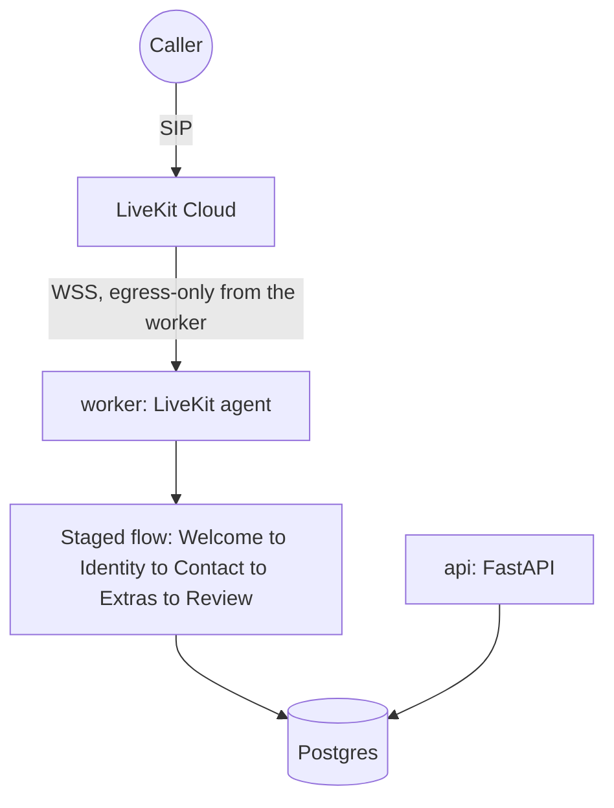

# Patient Intake Voice — Application + Operational Infrastructure

A telephone voice agent for a medical front desk (Part 1), plus the operational infrastructure
to run it in production for a healthcare company (Part 2): deployment, a Postgres-backed data
layer, backups with a documented restore path, telemetry, API structure, CI/CD, and
infrastructure-as-code.

**Phone number:** `+1 484 317 4139` — answers as "Sarah," a receptionist for a fictional
practice, and collects name/DOB/contact/insurance through a staged conversation.

## Verification status — read this first

Every config in this repo was written and statically checked (YAML/JSON parsed, HCL
cross-referenced by hand, Python/tests actually executed), but **this stack was built in a
sandbox with no Docker, no Terraform, no `gcloud`, and no browser for Railway's OAuth login** —
none of `docker build`, `terraform validate`, `gcloud builds submit`, or `railway login` were
run by me. Concretely:

- ✅ **Actually run and passing**: `uv run ruff check .`, `uv run python -m pytest` (23 tests),
  a live smoke test of `/health`, `/readyz`, `/metrics` via `TestClient` (no Docker needed for
  this — pure Python).
- ✅ **Actually verified against real behavior**: the Dockerfile's HF-cache fix, `download-files`
  auto-discovery, and the exact Prometheus metric names/labels the API exposes were each
  confirmed against the real `livekit-agents`/`prometheus-fastapi-instrumentator` source and a
  live smoke run — not assumed.
- ⚠️ **Written but not executed by me**: the actual Railway deployment (`RAILWAY.md`) and the
  GCP deployment (`infra/GCP_DEPLOYMENT.md`), including a real phone call against either. See
  each doc's own verification checklist for the exact commands to run.

I'm flagging this prominently rather than presenting untested infrastructure as proven.

## Deployment paths

Two, for two different constraints:

1. **Railway (`RAILWAY.md`) — the actual live deployment for this submission.** No cloud
   credentials were available at the time, and a managed platform is explicitly sanctioned by
   the challenge FAQ ("justify it and build operational tooling on top" — not just clicking
   Deploy). Worker + api + a managed Postgres.
2. **GCP (`infra/terraform/`, explained in `infra/GCP_DEPLOYMENT.md`) — written assuming GCP
   credentials exist.** Cloud Run for the worker/api (built and redeployed automatically by
   Cloud Build on every push to `main`), Secret Manager for every credential, and a GCS bucket
   for backups — reusing the same Railway Postgres as the database rather than standing up a
   second one.

## Architecture



The worker needs **no inbound port to function** — it dials LiveKit Cloud outbound over WSS and
receives call dispatches on that same connection. That's why the same app runs unmodified on
Railway (a PaaS with no host-level access) and on Cloud Run (request-driven, scale-to-zero by
default) alike — see `RAILWAY.md` and `infra/GCP_DEPLOYMENT.md` for how each platform's specific
constraints were handled (Cloud Run in particular needed the worker pinned to always-on with
CPU always allocated, since it doesn't serve the kind of inbound HTTP traffic Cloud Run expects
to scale on).

## Railway deployment (the live path for this submission)

Full steps in **`RAILWAY.md`** — worker + api + a managed Postgres, no cloud credentials
needed. The one code change it required, `app/store.py` normalizing Railway's bare
`postgresql://` `DATABASE_URL` to the `+psycopg` driver actually installed, is already in.
Basic up/down monitoring is live (an external uptime check against both services' health
endpoints); the custom Prometheus-style alert rules and automated backups aren't re-hosted
against this deployment yet — see `RAILWAY.md`'s "Known gaps" and "Monitoring" sections for the
honest accounting and the cheapest next step for each.

## GCP deployment (Cloud Run, assuming credentials exist)

Full explanation in **`infra/GCP_DEPLOYMENT.md`** — architecture, why the worker needed pinning
to always-on on Cloud Run specifically, how secrets/backups/CI-CD are wired, and a bootstrap
script:

```bash
cd infra/terraform
cp terraform.tfvars.example terraform.tfvars   # fill in; never commit the filled-in file
./deploy.sh
```

Provisions: Artifact Registry, Secret Manager secrets for every credential, two Cloud Run
services (worker pinned always-on; api scales to zero when idle), a Cloud Run Job + Cloud
Scheduler for backups to a GCS bucket (reusing `scripts/backup.sh`/`restore.sh` unchanged, via
GCS's S3-compatible endpoint), and a Cloud Build trigger that redeploys automatically on every
push to `main`. Uses the **same Railway Postgres** as the database — no second database to keep
in sync.

## Operating the system

- **Runbook** (`docs/RUNBOOK.md`): written against the original local Docker Compose stack this
  project used mid-build (since replaced by the Railway/GCP paths above) — the diagnostic
  approach (check logs by room name, verify `/readyz`, restore from backup) still applies, but
  some exact commands (`docker compose ...`) are stale. Treat it as reference for the
  *reasoning*, not copy-pasteable commands, until it's updated for the current deployment
  paths.
- **Security posture** (`docs/SECURITY.md`): PHI field inventory, subprocessor BAA list, what's
  implemented vs. deliberately deferred, mapped to HIPAA references.
- **Logs**: structured JSON everywhere — the worker via the LiveKit CLI's own JSON formatter
  (tagged with the call's `room` name, `app/worker.py`), the API via `app/obs.py` (tagged with
  a `request_id`). Railway and GCP Cloud Run both expose a searchable log viewer natively; no
  extra shipping/aggregation infrastructure is deployed for either path currently.
- **Alerting**: basic up/down only, and only on Railway (see above) — the fuller Prometheus/
  Grafana/Alertmanager design (`infra/observability/`) was built and works as *config*, but has
  no running deployment target right now (it was written against the local Compose stack,
  since removed). Kept in the repo as a reference design, not live tooling — see Known Risks.

## Verification checklist

0. **Railway** (do this one — it's the live submission path): follow `RAILWAY.md`, then call
   `+1 484 317 4139` and confirm `GET /patients` shows the new row in Railway's Postgres. Check
   both services' Railway log viewers for a clean deploy — worker should log `"registered
   worker"` once connected to LiveKit Cloud.
1. `uv run ruff check . && uv run python -m pytest -q` — should already be green; re-run after
   any change.
2. **GCP**: follow `infra/GCP_DEPLOYMENT.md`'s own verification section — `terraform fmt
   -check`/`validate` first (never run by me), then `./deploy.sh`, then the same phone-number
   and `/readyz` checks as above against the Cloud Run `api` URL.
3. **Don't run the Railway and GCP deployments at the same time** — both register a worker
   under the same LiveKit agent name (`my-agent`); whichever one you're not actively testing
   should be scaled down first (or simply not yet deployed).
4. Backup → restore drill (`RAILWAY.md`/`infra/GCP_DEPLOYMENT.md`, whichever path has backups
   configured) — **this is the one I'd personally not skip**: an unverified restore path is
   worse than no backup at all, because you find out it doesn't work during the actual
   incident.

## Prioritization — what got the time, and why

Spent roughly, across the whole build: fixing what was actually broken first, then Postgres +
telemetry/backups/CI groundwork, then a Railway pivot when cloud credentials didn't materialize,
then a GCP path written assuming they eventually would, docs throughout (not squeezed — a
quarter of the grading rubric is documentation, by the challenge's own weighting).

**Fixed before anything else**, because none of the rest matters if the base is broken:
- The original `Dockerfile` would crash at container startup: `download-files` ran as root
  writing to `/root/.cache/huggingface`, the runtime stage only copied `/app` and ran as an
  unprivileged `runner` user (home `/app`) — the turn-detector plugin loads with
  `local_files_only=True`, so it would hit `RuntimeError: ... Could not find file
  "model_q8.onnx"` on first real deploy. Fixed by setting `HF_HOME=/app/.cache/huggingface`
  before the download step.
- No `.dockerignore` + `COPY . .` would have baked `.env.local` (LiveKit secrets) and
  `records.db` (real patient data collected during Part 1 testing) directly into the image.
- `tests/test_flow.py` was broken (asserted against a helper function removed earlier in the
  same working session) — a real, if small, regression that had to be fixed before CI could
  mean anything.
- SQLite in a container means total data loss on every restart, and can't support real
  concurrency (multiple processes writing) — moved to Postgres.

**Deliberately skipped, and why:**

| Skipped | Reasoning |
|---|---|
| Kubernetes | Hundreds of calls/week on one worker doesn't need it; the brief explicitly warns against over-engineering here. |
| A second, GCP-native database | Railway's Postgres is already live and working; reusing it for the GCP path avoids running (and keeping in sync) two separate databases for one app. Documented as the first thing to change if the GCP path becomes primary. |
| Multi-region / HA | A single always-on worker instance is a conscious single point of failure at this call volume (and, on Cloud Run, a deliberate cap — see `infra/GCP_DEPLOYMENT.md` — since two workers would race for the same LiveKit dispatches). |
| External alert delivery (Slack/PagerDuty) | Not wired anywhere yet; the alert *rules* exist as config (`infra/observability/`) but have no running Prometheus to evaluate them against right now — see Known Risks. |
| Alembic / schema migrations | One table, `create_all()` only — adding migration tooling for a schema that hasn't changed yet buys nothing today. Flagged as required before the *next* schema change. |
| Full OpenTelemetry trace export for per-call LLM/STT/TTS latency | Investigated first: the pinned `livekit-agents` version's `metrics.LLMMetrics`/`TTSMetrics`/etc. classes have no active producer in this release (confirmed by exhaustively grepping the installed package — nothing in the SDK actually constructs one), so the `session.on("metrics_collected", ...)` pattern from older docs is a dead end here. What *is* real: the SDK's built-in Prometheus exporter (worker load, active call count, process-init timing) and per-call structured logs correlated by room name. Standing up a Tempo/Jaeger backend to consume the SDK's `set_tracer_provider` spans is the next step, not fabricated as already done. |
| Audit logging, encryption-in-transit between services, per-user auth | All real HIPAA gaps, all explicit in `docs/SECURITY.md` rather than half-implemented. |
| Self-hosted Prometheus/Grafana/Loki/Alertmanager, actually running somewhere | The config exists and is real (`infra/observability/`), written against a local Docker Compose stack that was later removed once Railway/GCP became the actual deployment targets. It's kept as a reference design, not claimed as live tooling — see Known Risks. |

## Known risks

- **This session's verification gap** (see top of file) is the single biggest risk right now —
  neither deployment path has been run end-to-end by me; the backup/restore drills and a real
  phone call against either need to actually happen once.
- **`infra/observability/` (Prometheus/Grafana/Loki/Alertmanager config) is not deployed
  anywhere right now** — it's real, reviewable config, but nothing currently runs it. Either
  wire it up against one of the two live paths, or remove it to avoid the repo describing
  tooling that isn't actually operating.
- **No authentication on the patient-record API at all**, on either deployment path — an
  API-key requirement was built and then deliberately rolled back to keep the app matching its
  pre-assessment behavior. Anyone who can reach the API can read/write/archive every patient
  record. See `docs/SECURITY.md`.
- **PHI leaves the boundary** to LiveKit/Deepgram/OpenAI/Cartesia/ai-coustics — no BAAs are in
  place; see `docs/SECURITY.md`.
- **No rollback-to-immutable-image path on Railway** — GCP's Cloud Build pipeline at least tags
  images by commit SHA; Railway's redeploy-from-dashboard is the rollback mechanism there
  instead.
- **Alerting has no external delivery anywhere except Railway's basic uptime check** — see
  `RAILWAY.md`'s Monitoring section for what that does and doesn't cover.
- **`docs/RUNBOOK.md` is stale** relative to the current deployment paths (written against the
  removed Compose stack) — the diagnostic reasoning holds, the exact commands don't all still
  apply.

## Next steps, in the order I'd actually do them

1. Run both deployment paths' verification checklists for real (Railway now, GCP once
   credentials + `terraform`/`gcloud` are available).
2. Decide whether `infra/observability/` gets wired up against one of the live deployments or
   removed — right now it's the one piece of the repo describing tooling that isn't operating.
3. Add real backups + basic alerting to whichever path ends up primary, if it isn't already
   (GCP has both built in; Railway currently only has the uptime check).
4. Wire an OTel trace exporter (Tempo/Grafana Cloud Tempo) so per-call LLM/STT/TTS latency is
   graphable, not just log-greppable.
5. Add real API authentication (per-caller OAuth/OIDC, not a single shared key) plus the
   audit-log table from `docs/SECURITY.md`.
6. Update `docs/RUNBOOK.md` for whichever deployment path is primary, so its commands are
   copy-pasteable again instead of just directionally correct.

---

## Application details (Part 1)

A caller dials the number, the agent walks them through registration one step at a time,
validates each answer, reads everything back for confirmation, and saves the record. The same
data is available over HTTP for lookups and edits.

### How it's put together

The call is not driven by one big prompt. It is a pipeline of small **stages**, each responsible
for a slice of the form and each handing control to the next when its part is done:

```
Welcome  →  Identity  →  Contact  →  Extras (optional)  →  Review & save
```

Collected values accumulate in a single `IntakeState` object attached to the session, so a stage
only ever sees the tools and instructions relevant to its step. This keeps each LLM turn small
(better latency) and makes the flow easy to reason about and extend.

### Modules

| File | Responsibility |
|------|----------------|
| `app/worker.py` | LiveKit entrypoint — assembles the STT/LLM/TTS pipeline, starts the flow, exposes health + Prometheus metrics. |
| `app/flow.py` | `IntakeState` + the five stage agents and their handoff/validation tools; logs save outcomes for call↔record tracing. |
| `app/schema.py` | Reusable `Annotated` validated field types and the `NewPatient` / `PatientChanges` models. |
| `app/schema.sql` | Explicit Postgres DDL mirroring `app/store.py`'s ORM model — not required (the app creates its own schema on startup), useful for inspecting/pre-creating it by hand. |
| `app/store.py` | `PatientStore` (SQLAlchemy) — reads, writes, archive (soft delete), and a `/readyz` ping. |
| `app/web.py` | FastAPI service: patient CRUD, `/health`, `/readyz`, `/metrics`. |
| `app/obs.py` | JSON log formatter + request-id middleware for the API. |
| `app/us_states.py` | Accepted USPS state/territory codes. |

### Tech

- **LiveKit Agents** for the real-time voice pipeline and telephony.
- **LiveKit Inference** for STT (`deepgram/nova-3`), LLM (`openai/gpt-4.1`), and TTS
  (`cartesia/sonic-3`) — one set of LiveKit credentials, no separate provider keys.
- **Silero VAD** + **multilingual turn detector** for turn-taking; **ai-coustics** noise
  cancellation for phone audio.
- **FastAPI** + **SQLAlchemy** + **Postgres** (SQLite fallback for quick local `uv run` use) for
  storage and the REST API.
- **Pydantic** + **phonenumbers** for validation and US phone/email normalization.
- **uv** for environment and dependency management; **Docker** for the deployable image;
  **Terraform** for the GCP deployment.

### Running without Docker (quick local dev/console testing)

```bash
uv sync
uv run python -m livekit.agents download-files   # first run only
uv run python -m app.worker console               # talk to it via mic/speaker, no phone needed
uv run uvicorn app.web:app --reload                # REST API at http://localhost:8000/docs
```

Uses `.env.local` (loaded by `app/worker.py`) and falls back to a local SQLite file if
`INTAKE_DB_URL` isn't set — unrelated to whichever deployment (Railway or GCP) is actually
answering `+1 484 317 4139` at a given time.

### API endpoints

Responses are the patient resource itself (no envelope); errors use standard status codes.
No authentication on any route — see `docs/SECURITY.md` for why that's a real gap before real
PHI, and the Known Risks above.

- `GET /health` — liveness (static, no DB touch)
- `GET /readyz` — readiness (real DB round-trip)
- `GET /metrics` — Prometheus format
- `GET /patients?family_name=&birth_date=&phone=`
- `GET /patients/{record_id}`
- `POST /patients` → `201`
- `PATCH /patients/{record_id}` — partial update; only supplied fields change
- `DELETE /patients/{record_id}` — archive (soft delete; drops out of reads)

### Fields

Required: `given_name`, `family_name`, `birth_date`, `sex`
(`Male`/`Female`/`Other`/`Decline to answer`), `phone`, `street`, `city`, `state`,
`postal_code`. Optional: `unit`, `email`, `insurer`, `member_id`, `language`, `contact_name`,
`contact_phone`.

### Tests

```bash
uv run python -m pytest
```

23 tests: validation layer (phone/date/state/zip/sex/email normalization, required-field
enforcement), the full API flow (create/read/filter/partial-update/archive, `/health`,
`/readyz`), and the flow/state contract (`IntakeState.collected()`, the paced per-line spoken
readback).

### Application-level trade-offs (Part 1, still true in Part 2)

- A returning caller (matched by phone) is offered an update; the flow then re-collects and
  applies the details to the existing record — `save_record` marks the state as "updating" once
  a row exists so a later in-call correction updates rather than duplicates it.
- Telephony binding: the worker registers under the agent name `my-agent` so the existing SIP
  dispatch rule/number routes to it unchanged. Change `DISPATCH_AGENT_NAME` in `app/worker.py`
  if you dispatch to a different name.
