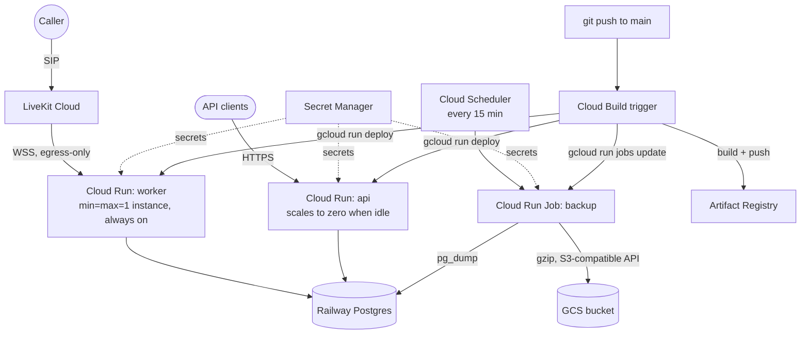

# GCP Deployment (Cloud Run + Cloud Build + Secret Manager + GCS)

Everything in `infra/terraform/` describes this deployment: two Cloud Run services (worker,
api) built from the repo's root `Dockerfile`, a Postgres database on **Railway** (not a GCP
database — Cloud Run just connects to it over the internet, same as connecting from anywhere
else), backups to a GCS bucket, and a Cloud Build pipeline that redeploys automatically on every
push to `main`.

Written assuming GCP credentials/a project already exist. Everything here is unapplied — it
was written and cross-checked by hand (every resource/variable reference, every secret key
used consistently across files) but never run against a real project, since this build
environment has neither `terraform` nor `gcloud` installed. Run `terraform fmt -check` and
`terraform validate` yourself before `apply` — see the Verification section at the bottom.

## Architecture



## Why Cloud Run needed one small app change

Cloud Run expects a container to listen on the port it injects via the `PORT` env var, and
health-checks the container there before considering a revision "ready." The worker
(`app/worker.py`) already runs a small HTTP health server (`AgentServer`'s own `:8081`
liveness endpoint — same one used locally/on Railway), but it didn't previously read `$PORT`.
One line now makes it do so:

```python
server = AgentServer(
    port=int(os.environ.get("PORT", "8081")),  # respects Cloud Run's $PORT; defaults to 8081
    ...                                          # everywhere PORT isn't set (Railway, Compose, bare `uv run`)
)
```

The `api` service needs no code change at all — its Cloud Run container command
(`cloud_run.tf`) runs `uv run uvicorn app.web:app --host 0.0.0.0 --port $PORT` directly through
a shell, so it already respects whatever port Cloud Run assigns.

## Why the worker can't just be a normal Cloud Run service

Cloud Run's core model is request-driven: scale to zero when idle, spin up on demand. That's
perfect for `api`, and wrong for `worker` — it doesn't serve inbound HTTP traffic at all; its
job is to hold open a persistent outbound WebSocket connection to LiveKit Cloud and process call
dispatches in the background. Two settings in `cloud_run.tf` make it behave like an
always-on process instead of a scale-to-zero one:

- `scaling { min_instance_count = 1; max_instance_count = 1 }` — never scales to zero (it
  would stop answering calls), and never scales above one instance (two workers would both
  register under the same LiveKit agent name and race for call dispatches against two
  independent code paths).
- `resources { cpu_idle = false }` — keeps CPU allocated even between HTTP requests, since
  Cloud Run's default ("CPU only during request processing") would throttle the background
  event loop that actually runs the voice pipeline.

This does mean the worker is billed like an always-on small VM, not a scale-to-zero function —
that's inherent to what it does, not a Cloud Run misconfiguration.

## Secrets

Every credential is a Secret Manager `SecureString`-equivalent secret (`secrets.tf`), set on
each Cloud Run service/job via a real secret reference (`value_source.secret_key_ref`), never a
plain env var:

| Secret | Used by | Source |
|---|---|---|
| `livekit-url`, `livekit-api-key`, `livekit-api-secret` | worker | `terraform.tfvars` |
| `intake-db-url` | worker, api | Constructed from the `railway_pg_*` variables |
| `postgres-host/port/db/user/password` | backup job | The same `railway_pg_*` variables, individually — `pg_dump`/`psql` take separate args, not one URL |
| `aws-access-key-id`, `aws-secret-access-key` | backup job | A `google_storage_hmac_key` Terraform creates automatically — GCS's S3-compatible endpoint auth, not a real AWS account |

No secret value is ever in this repo, in the Cloud Build logs, or baked into an image —
`terraform.tfvars` (gitignored) is the only place they're typed in.

## Backups

Reuses `scripts/backup.sh`/`restore.sh` unchanged — the exact same scripts already written and
documented for the (now-removed) local Docker Compose stack. They talk to storage purely
through the S3 API via `scripts/s3_object.py` (boto3), and **GCS exposes an S3-compatible XML
API**, so pointing `AWS_ENDPOINT_URL` at `https://storage.googleapis.com` with a GCS-issued HMAC
key pair (`google_storage_hmac_key` in `storage.tf`) is enough — no new backup code, no new
Python dependency, no GCS-specific SDK.

- **`infra/backup/Dockerfile`** — postgres-client + boto3 + the scripts, nothing else. Built and
  pushed by the same Cloud Build pipeline as the app image.
- **`google_cloud_run_v2_job.backup`** (`backup.tf`) — runs `./backup.sh` once per invocation.
  A Job, not a long-running loop like the old Compose service: Cloud Run Jobs bill only for the
  seconds an execution actually takes.
- **`google_cloud_scheduler_job`** — triggers the job every 15 minutes via the Cloud Run Admin
  API's `:run` endpoint, authenticated as the same runtime service account.
- `PUSHGATEWAY_URL` is deliberately left unset here — `backup.sh` was fixed to make that
  heartbeat push optional (it used to unconditionally `curl -f` a Pushgateway URL and would
  have hard-failed every single run on GCP, since there's no Prometheus/Pushgateway in this
  deployment at all). The backup itself doesn't depend on it.

**To restore:**
```bash
gcloud run jobs execute patient-intake-backup \
  --region=<region> --command=./restore.sh --args=<optional-specific-backup-key>
```
Omitting `--args` restores the most recent backup (`restore.sh`'s default behavior, unchanged
from the Compose version — see the script itself for the exact `latest-key` logic).

## CI/CD

Push to `main` → `google_cloudbuild_trigger` fires → `infra/terraform/cloudbuild.yaml`:
1. Build the app image (root `Dockerfile`) and the backup image (`infra/backup/Dockerfile`).
2. Push both, tagged `:$COMMIT_SHA` and `:latest`, to Artifact Registry.
3. `gcloud run deploy` the worker and api services with the new image.
4. `gcloud run jobs update` the backup job with its new image.

Deploy calls only pass `--image` — everything else (secrets, scaling, service account,
command/args) was set once by Terraform and Cloud Run preserves it across an image-only
update. Terraform owns the service *definition*; Cloud Build owns the *image* running inside
it (`cloud_run.tf`'s `lifecycle.ignore_changes` is what stops a later `terraform apply` from
reverting Cloud Build's deploy back to the bootstrap placeholder image).

## One manual prerequisite Terraform can't automate

The Cloud Build **GitHub App** must be connected to this repo once via GCP Console
(**Cloud Build → Triggers → Connect Repository → GitHub**) before `google_cloudbuild_trigger`
can be created — that OAuth handshake isn't exposed through the Terraform provider for the
classic trigger style used here. Do this once, before the first `terraform apply`.

## Running it

```bash
cd infra/terraform
cp terraform.tfvars.example terraform.tfvars   # fill in — see below for what each value is
./deploy.sh
```

`deploy.sh`: checks `terraform`/`gcloud`/`docker` are installed and you're logged in
(`gcloud auth login` first if not), runs `terraform init && terraform apply` (creates
everything except the *real* running image), then does the first build+deploy itself by
running `infra/terraform/cloudbuild.yaml` manually via `gcloud builds submit` — the exact same
pipeline the trigger uses on every push after that. One script, whole deployment; you don't
run it again for future changes, `git push` does.

**What you need before running it:**
- A GCP project with billing enabled, and `gcloud auth login` already run.
- A Railway Postgres instance already up (its host/port/user/password/database, from Railway's
  Postgres service → Variables tab).
- LiveKit Cloud credentials (URL, API key, API secret).
- The Cloud Build GitHub connection above, done once.
- A globally-unique name for `backup_bucket_name` in `terraform.tfvars`.

## Known gaps (honest, not hidden)

- **No observability stack on GCP** — no Prometheus/Grafana/Alertmanager here at all. This
  wasn't in scope for this pass (the brief was specifically Cloud Run + Cloud Build + GCS
  backups + Railway's database); Cloud Run's own request/latency/error metrics and log
  explorer are available natively in GCP Console with zero extra setup, and are the
  closest built-in equivalent for now.
- **`terraform validate`/`fmt` were never run** — no Terraform binary in the environment this
  was written in. Run them before `apply`; if a resource attribute has drifted from the exact
  `google` provider version pinned in `versions.tf` (`~> 6.10`), that's where it'd surface.
- **Project-level `secretmanager.secretAccessor`** on the runtime service account (`iam.tf`) is
  broader than the per-secret bindings a stricter least-privilege setup would use — reasonable
  for a single-app project, worth tightening if this project ever hosts something else too.
- **`allUsers` invoker on `api`** (`cloud_run.tf`) means the REST API has no authentication at
  all, matching the Railway deployment's current posture (see `docs/SECURITY.md` for why, and
  what real auth would need) — not a Cloud-Run-specific gap, just carried over.
- **Running this alongside the Railway deployment** would mean two workers registered under the
  same LiveKit agent name (`my-agent`), racing for call dispatch against two separate deploys of
  the same database. Run one or the other, not both, exactly like the Railway/Compose caution
  in the main README.

## Verification

Since this was never applied:
1. `terraform fmt -check` and `terraform validate` in `infra/terraform/` — first thing to run.
2. `terraform plan` — read it before `apply`; confirm resource counts match what's described
   above (roughly: 1 Artifact Registry repo, ~10 IAM bindings/service accounts, 1 GCS bucket +
   HMAC key, ~11 Secret Manager secrets+versions, 2 Cloud Run services, 1 Cloud Run Job, 1
   Cloud Scheduler job, 1 Cloud Build trigger).
3. `./deploy.sh`, then call the phone number and confirm the worker's Cloud Run logs (GCP
   Console → Cloud Run → patient-intake-worker → Logs) show `"registered worker"`.
4. `curl https://<api-url>/health` and `/readyz`.
5. `gcloud run jobs execute patient-intake-backup --region=<region>` manually once, confirm an
   object lands in the GCS bucket, then do a real restore drill exactly as described above.
6. Push a trivial commit to `main`, confirm the Cloud Build trigger fires (GCP Console →
   Cloud Build → History) and both services pick up the new image.
